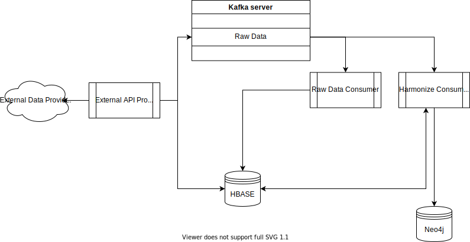

#Mapping Project.

This project contains the harmonizators to create the harmonization of the different sources to the Database.

The architecture used for the import and harmonization of the sources is as follows:


The different components of the architecture are depicted in the following list:

- **External API Producer:** This component is in charge to communicate to the different external providers and make the pertinent requests to obtain the data. This component is able to store the data directly to *HBASE* or send it to the *KAFKA* to be processed later.
- **Raw Data Consumer:** This component consumes the raw data from *KAFKA* and stores its components directly to *HBASE*. This is done to always keep the original information without any modification.
- **Harmonize Consumer:** This component consumes the raw data from *KAFKA* or *HBASE* and applies the harmonization to transform this data to the data model. Finally, it stores the data in *Neo4j* or *HBASE* as required.

## To create a database with the initial information

1. Set the project to use the correct configuration:
```json
{
  "hbase_imported_data": {
    "host": "",
    "port": 9090,
    "table_prefix": "",
    "table_prefix_separator": ":"
  },
  "hbase_harmonized_data": {
    "host": "",
    "port": 9090,
    "table_prefix": "",
    "table_prefix_separator": ":"
  },
  "kafka": {
    "hosts": [""],
    "ports": [29092]
  },
  "neo4j": {
    "uri": "",
    "auth": ["", ""],
    "encrypted": true,
    "trust": ""
  },
  "encript_pass": {
    "environment": "SECRET_PASSWORD"
  }
}
```
and set the config file name in the settings.py file.

2. Export the environment variable defined in the "encript_pass" in order to be able to encrypt the password for the users.
```bash
export SECRET_PASSWORD="password"
```

We are ready to import the initial data to the database. This data is related to the static organizations (at least the main organization) and initial data sources (optional).

 ```bash
 python -m Organization -f "file.xls" -name "Name of Main Organization" -n "uri namespace" -u "user"
 python -m DataSources -f "file.xls" -name "Name of Main Organization" -n "uri namespace" -u "user" -d "Datasource"
 ```

Once the initial data for an organization has been set, we can start the harmonizer in two different ways:

##### Read Data from previously HBASE tables:
This option is used when we want to harmonize a full load of data that has been previously stored in hbase as raw_data

```bash
python -m GPG -name <> -n <> -u <> [-o] 
python -m Gemweb -name <> -n <> -u <> -t <>
python -m Datadis -name <> -n <> -u <> -t <>
python -m EEM -name <> -n <> -u <>
```

##### Read new data from kafka:
This option is used to update and harmonize new data each time it is imported into the kafka topic.
It will start a process that will wait idle until a new data set is introduced to the topic, and then, 
it will be activated to process the message.

```bash
python main.py
```